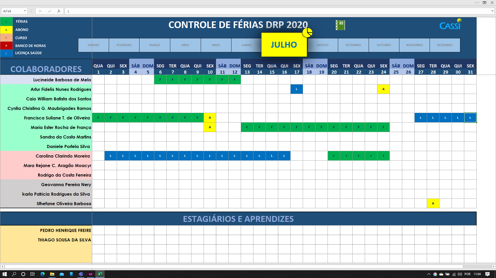

# Sistema de gerenciamento de Férias

## Desvantagens da versão atual

1.     Planilha do excel com pastas de trabalho para cada mês do ano;
2.     Para cada novo ano, é necessário revisar individualmente cada pasta de trabalho;
3.     Para cada novo colaborador, é necessário modificar 12 pastas de trabalho (Para incluir o mesmo no sistema);
4.     Para evitar edições e acessos indevidos, a maneira mais eficiente no momento é bloquear as células importantes;
5.     Capacidade de filtragem limitada;
6.     Escalabilidade limitada;
7.     Capacidade de oferecer UX/UI flexível limitada;
8.     Baixa manutenibilidade;
9.     Curva de aprendizado acentuada para novos operadores;

## Capturas de tela

#

# Sistema novo

1.     Possibilidade de implementar autenticação mais avançada
2.     Capacidade de filtragem de informações superior
3.     Melhor manutenibilidade
4.     Facilita a construção de uma UX/UI melhor e mais flexível
5.     Mais escalável
6.     Estruturação interna de dados superior

## Capturas de tela

- 
- 
- 

