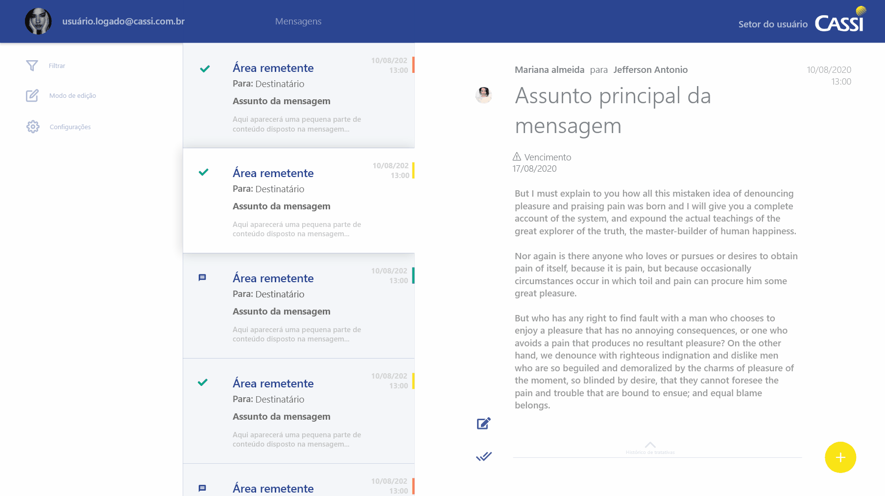
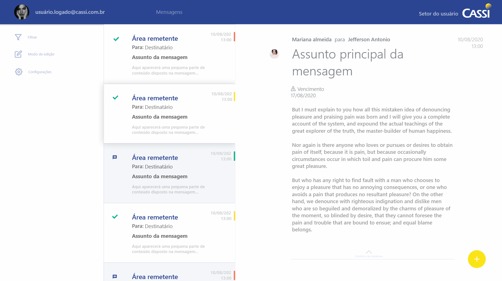
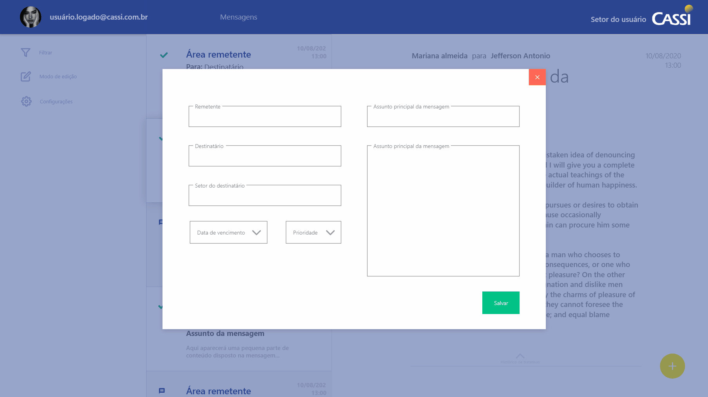

# Sistema de Gestão de Respostas CASSI (SiGRC)

## 1. Visão geral

> ### Domínio
>
> A caixa de e-mail da divisão recebe algumas mensagens que precisam de acompanhamento. O sistema objeto deste documento visa prover controle sobre a situação dessas mensagens.

## 2. UX/UI

<!-- Tela principal -->
| Tela principal                                      |
| --------------------------------------------------- |
|  |

<!-- Histórico de tratativas de uma mensagem -->
| Histórico de tratativas de uma mensagem                      |
| ------------------------------------------------------------ |
|  |

<!-- Incluindo mensagens -->
| Incluindo mensagens                                   |
| ----------------------------------------------------- |
|  |

<!-- Definindo prioridade -->
| Definindo a prioridade de uma mensagem                    |
| --------------------------------------------------------- |
|  |

> # Componentes
> ## Item de mensagem
>> |Item selecionado|Item sem foco|
>> |-|-|
>> |||
>
> ## Prioridades
>> |Representação| Legenda|
>> |-|-|
>> ||Alta prioridade|
>> ||Média prioridade|
>> ||Baixa prioridade|

## 3. Persistência

> ### Banco de dados
> Os registros do sistema são essencialmente mantidos `localmente` em um banco de dados não relacional. Cada instância em operação busca um arquivo estruturado com conteúdo `serializado` localizado na pasta de dados compartilhada em rede.
>
> ### Exportação de dados
> Dentro da pasta de dados compartilhada de uma divisão existe dois arquivos: um com extensão **.hive** e outro com extensão **.lock**. Os dados armazenados ficam salvos neles.

## 4. Distribuição interna

> ### Dentro de uma divisão
>
> Assumindo que em algum momento o sistema poderá `receber` acessos concorrentes dentro da sua esfera de execução, é necessário que os `colaboradores de uma mesma divisão` tenham acesso aos mesmos dados. Para que isso ocorra, a divisão deve ter um local na rede para armazenar os dados compartilhados e somado a isso, `todas as instâncias do SiGRC em execução devem apontar para o mesmo banco de dados local` isso pode ser feito especificando o caminho completo do banco de dados nas configurações do SiGRC. Para que todos possam apontar para o mesmo local, é indicado que ele esteja localizado em uma `pasta na rede`.
>
> ### Entre divisões
> Para distribuir o sistema em outras divisões, é preciso apenas compartilhar uma cópia da pasta que contém o mesmo, e posteriormente, cada colaborador com acesso deve configurar o caminho para o banco de dados compartilhado da divisão.
>
>> ### Observações
>> * O SiGRC é destinado para uso interno da CASSI, portanto, pode ser que ele não atenda exatamente todas as necessidades de uso externo.
>> * Por enquanto não há a necessidade de incluir autenticação baseada em múltiplos níveis de acesso. A implementação desse recurso vai depender das demandas futuras para a ferramenta.

## 5. Requisitos

> ### Execução
> Para que o SiGRC seja executado, é necessário que o sistema tenha o  [`vc_redist140.dll`][1] instalado, recomenda-se windows 8 ou superior.

<!-- Links -->
[1]: https://1drv.ms/u/s!AhxK2oo7aqih1VNjV_7NY1ECsmeI?e=TYlIt2